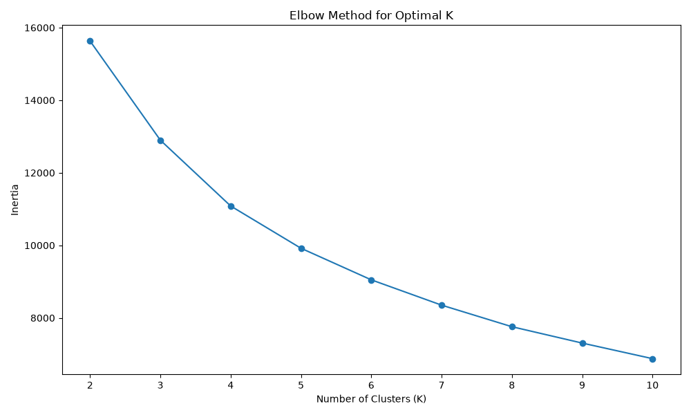
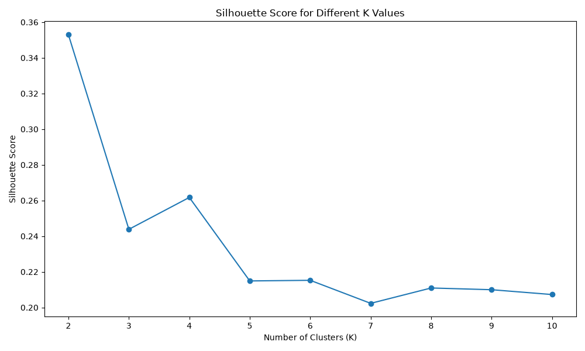
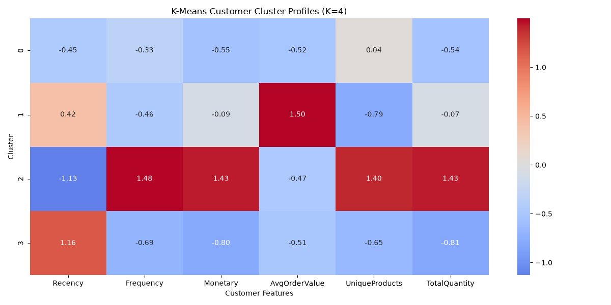
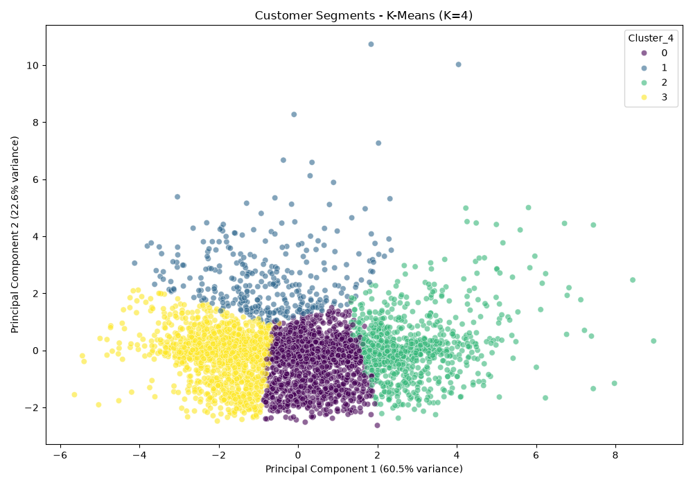
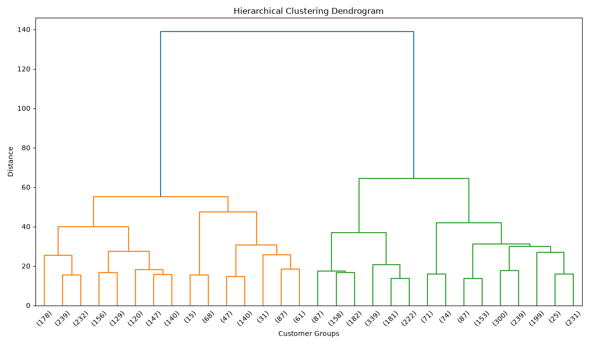
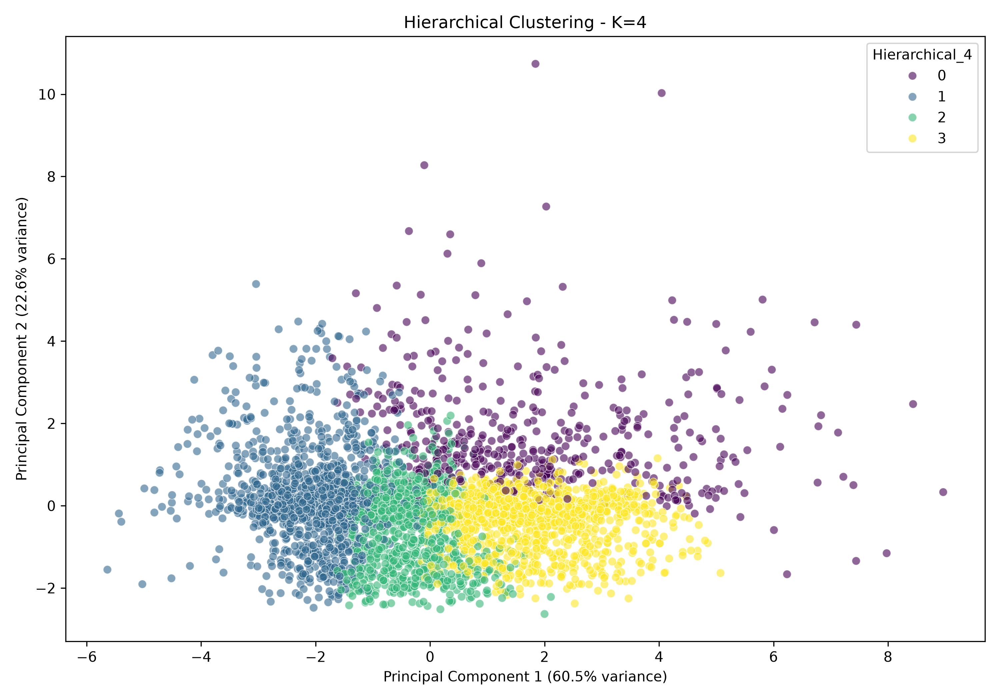

# E-Commerce Customer Segmentation

An end-to-end unsupervised machine learning project for segmenting e-commerce customers based on purchasing behavior and identifying unusual customer activity.

The project uses the UCI Online Retail dataset and combines customer-level feature engineering, K-Means clustering, hierarchical clustering, DBSCAN, PCA visualization, and Isolation Forest anomaly detection.

## Project Overview

The goal is to transform transaction-level e-commerce data into meaningful customer profiles that can support customer analysis and targeted business strategies.

The project focuses on:
- Customer behavior segmentation
- Recency, frequency, and monetary analysis
- Comparing multiple clustering approaches
- Visualizing customer segments with PCA
- Identifying unusual customer behavior with anomaly detection

## Dataset

**Dataset:** UCI Online Retail

The original dataset contains **541,909 transaction records** and 8 columns.

Key fields include:
- `InvoiceNo` - invoice identifier
- `StockCode` - product identifier
- `Description` - product description
- `Quantity` - quantity purchased
- `InvoiceDate` - transaction date
- `UnitPrice` - price per unit
- `CustomerID` - customer identifier
- `Country` - customer country

### Data Cleaning

The following preprocessing steps were applied:
- Removed duplicate transactions
- Removed records without `CustomerID`
- Removed transactions with non-positive quantities
- Removed transactions with non-positive unit prices
- Removed cancellation invoices

After cleaning, **392,692 transaction records** remained.

## Customer Feature Engineering

A `TotalPrice` feature was created:

```text
TotalPrice = Quantity × UnitPrice
```

Transaction-level data was aggregated into customer-level behavioral features:

| Feature | Description |
|---|---|
| `Recency` | Number of days since the customer's most recent purchase |
| `Frequency` | Number of unique invoices/orders |
| `Monetary` | Total customer spending |
| `AvgOrderValue` | Average transaction value |
| `UniqueProducts` | Number of unique products purchased |
| `TotalQuantity` | Total number of items purchased |

The resulting customer feature dataset contains **4,338 customers**.

## Machine Learning Workflow

```text
Raw Transaction Data
        ↓
Data Cleaning
        ↓
Customer-Level Feature Engineering
        ↓
Log Transformation
        ↓
StandardScaler
        ↓
Clustering Analysis
   ┌────┼───────────────┐
   ↓    ↓               ↓
K-Means  Hierarchical   DBSCAN
   ↓        ↓
PCA      Dendrogram
   ↓
Cluster Profiles
   ↓
Isolation Forest
   ↓
Anomaly Detection
```

## Preprocessing

Customer purchasing features are highly right-skewed, particularly monetary value and quantity.

To reduce the effect of extreme values, `log1p` transformation was applied before standardization with `StandardScaler`.

## K-Means Clustering

K-Means was evaluated for **K=2 through K=10** using the elbow method and silhouette score.





The highest silhouette score was obtained at **K=2 (approximately 0.353)**.

However, **K=4 was selected for the final segmentation** because it provided more granular and interpretable customer behavior profiles. Therefore, K=4 was selected as a practical segmentation choice rather than because it had the highest silhouette score.

### Final K-Means Segments

| Cluster | Interpreted Segment | Characteristics |
|---|---|---|
| 0 | Moderate Engagement / Moderate Value | Moderate recency, frequency, spending, and product diversity |
| 1 | High-Value / Low-Frequency | Lower purchase frequency but substantially higher average order value |
| 2 | Highly Engaged / High-Value | Recent, frequent purchasing with high spending and product diversity |
| 3 | Inactive / Low-Value | Higher recency with relatively low frequency, spending, and quantity |

The cluster names above are interpretations of the observed profiles; K-Means cluster labels themselves are arbitrary.

### Cluster Profile Heatmap



The heatmap uses standardized cluster profiles so features with different numerical scales can be compared visually.

## PCA Visualization

PCA was used to project the standardized customer feature space into two dimensions.

The first two principal components explain approximately **83.1% of the total variance**:
- PC1: approximately 60.5%
- PC2: approximately 22.6%

### K-Means Customer Segments



## Hierarchical Clustering

Agglomerative hierarchical clustering with Ward linkage was evaluated for K=2, K=3, and K=4.

| K | Silhouette Score |
|---|---:|
| 2 | 0.3291 |
| 3 | 0.1641 |
| 4 | 0.1672 |

A dendrogram was generated to visualize the hierarchical structure:



### Hierarchical PCA Visualization



The hierarchical clustering results provide a comparison with the K-Means partitioning of the same customer feature space.

## DBSCAN

DBSCAN was evaluated with several `eps` values while keeping `min_samples=10`.

| eps | Clusters | Noise Points | Silhouette Score |
|---:|---:|---:|---:|
| 0.5 | 4 | 1,624 | -0.0301 |
| 0.7 | 2 | 556 | 0.2719 |
| 0.9 | 1 | 254 | N/A |
| 1.1 | 1 | 116 | N/A |

For further analysis, `eps=0.7` was used.

DBSCAN identified **556 observations as noise**. A DBSCAN noise point is not automatically an anomaly or fraudulent customer; it means the observation was not assigned to a sufficiently dense cluster under the selected parameters.

## Isolation Forest Anomaly Detection

Isolation Forest was used to identify customers whose overall purchasing behavior is unusual relative to the rest of the customer population.

Configuration:

```python
IsolationForest(
    n_estimators=200,
    contamination=0.05,
    random_state=42
)
```

Results:
- **4,121 normal customers**
- **217 anomalous customers**
- **5.00% anomaly rate**

| Feature | Anomalous Customers | Normal Customers |
|---|---:|---:|
| Recency | 90.08 | 92.67 |
| Frequency | 16.96 | 3.60 |
| Monetary | 16,911.56 | 1,266.05 |
| AvgOrderValue | 919.45 | 23.57 |
| UniqueProducts | 122.96 | 58.26 |
| TotalQuantity | 9,695.86 | 739.63 |

The anomalous customer profile is characterized primarily by unusually high purchasing activity and value.

These observations should be interpreted as **unusual customer behavior**, not automatically as fraudulent activity. They may represent high-value customers, bulk buyers, wholesale-like purchasing patterns, unusually large orders, or other unusual purchasing behavior.

### Example Anomalous Customers

| CustomerID | Frequency | Monetary | AvgOrderValue | UniqueProducts | TotalQuantity |
|---:|---:|---:|---:|---:|---:|
| 16446 | 2 | 168,472.50 | 56,157.50 | 3 | 80,997 |
| 14911 | 201 | 143,711.17 | 25.35 | 1,787 | 80,240 |
| 18102 | 60 | 259,657.30 | 602.45 | 150 | 64,124 |
| 12346 | 1 | 77,183.60 | 77,183.60 | 1 | 74,215 |
| 14646 | 73 | 280,206.02 | 134.97 | 700 | 196,915 |

More negative Isolation Forest scores indicate observations that are more isolated under the fitted model.

## Project Structure

```text
ecommerce-customer-segmentation/
│
├── data/
│   ├── Online Retail.xlsx
│   └── customer_features.csv
│
├── models/
│   ├── kmeans_model.pkl
│   └── scaler.pkl
│
├── results/
│   ├── elbow_curve.png
│   ├── silhouette_scores.png
│   ├── pca_k4_clusters.png
│   ├── pca_hierarchical_k4_clusters.png
│   ├── cluster_profile_heatmap.png
│   ├── hierarchical_dendrogram.png
│   ├── transaction_value_distribution.png
│   ├── top_countries.png
│   └── customer_segments.csv
│
├── src/
│   ├── data_analysis.py
│   ├── model_training.py
│   └── predict.py
│
├── .gitignore
├── README.md
└── requirements.txt
```

## Installation

```bash
git clone https://github.com/Tenzeela/ecommerce-customer-segmentation.git
cd ecommerce-customer-segmentation
```

### Windows

```powershell
python -m venv venv
venv\Scripts\activate
```

Install dependencies:

```bash
pip install -r requirements.txt
```

## Running the Project

### 1. Run data analysis

```bash
python src/data_analysis.py
```

This performs data exploration, cleaning, feature engineering, and creates:

```text
data/customer_features.csv
```

### 2. Train clustering and anomaly models

```bash
python src/model_training.py
```

This generates the clustering evaluations, visualizations, customer segments, and anomaly analysis.

### 3. Predict a customer's segment

```bash
python src/predict.py
```

The prediction script loads the saved K-Means model and scaler and predicts the segment of a new customer based on behavioral features.

## Technologies Used

- Python
- Pandas
- NumPy
- Matplotlib
- Seaborn
- Scikit-learn
- SciPy
- Joblib
- OpenPyXL

## Key Takeaways

- Customer segmentation can be performed from transaction-level purchasing behavior.
- Log transformation helps reduce the influence of highly skewed purchasing features.
- K-Means, hierarchical clustering, and DBSCAN provide different views of customer structure.
- K=2 achieved the highest K-Means silhouette score, while K=4 provided a more granular segmentation for interpretation.
- PCA provides a useful two-dimensional visualization, with the first two components explaining approximately 83.1% of the variance.
- Isolation Forest identified 217 customers with unusually distinctive purchasing behavior.

## Future Improvements

- Test additional clustering validation metrics
- Compare alternative feature-selection strategies
- Evaluate additional anomaly-detection methods
- Build an interactive customer segmentation dashboard
- Add automated segment-level business recommendations
- Deploy the prediction pipeline as an API or web application

## Author

**Tenzeela Saeed**

AI/ML Researcher | NLP | Machine Learning | LLMs
